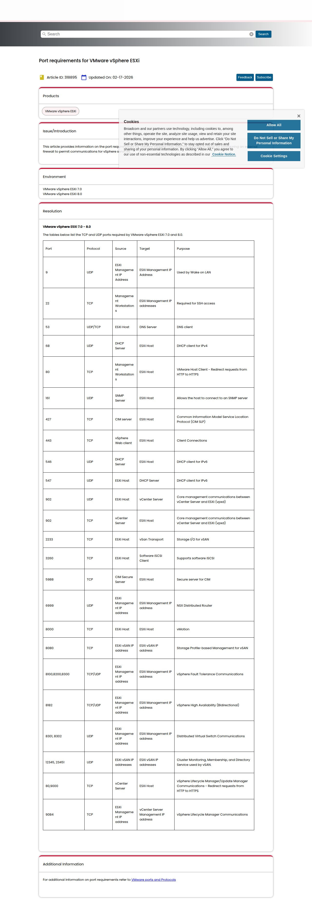

# Visited: https://knowledge.broadcom.com/external/article/318895/port-requirements-for-vmware-vsphere-esx.html
**Time:** Sat May  9 06:42:43 UTC 2026

## Screenshot

## Raw HTML
[page.html](./page.html)

## Downloaded Media (2 files)
## Downloaded Media Files

## Other Links
- [https://cdn.cookielaw.org/scripttemplates/otSDKStub.js](https://cdn.cookielaw.org/scripttemplates/otSDKStub.js)
- [https://cdn.wolkenservicedesk.com/Broadcom_%20Footer.html](https://cdn.wolkenservicedesk.com/Broadcom_%20Footer.html)
- [https://cdn.wolkenservicedesk.com/Broadcom_%20Header.html](https://cdn.wolkenservicedesk.com/Broadcom_%20Header.html)
- [https://fonts.googleapis.com/css?family=Poppins:300,400,500](https://fonts.googleapis.com/css?family=Poppins:300,400,500)
- [https://fonts.googleapis.com/icon?family=Material+Icons](https://fonts.googleapis.com/icon?family=Material+Icons)
- [https://knowledge.broadcom.com/external/article/318895/port-requirements-for-vmware-vsphere-esx.html](https://knowledge.broadcom.com/external/article/318895/port-requirements-for-vmware-vsphere-esx.html)
- [https://ports.broadcom.com/](https://ports.broadcom.com/)
- [https://searchunify.broadcom.com/resources/Allow/an.js?uid=1fd47e1f-f7d9-11ea-beba-0242ac12000b](https://searchunify.broadcom.com/resources/Allow/an.js?uid=1fd47e1f-f7d9-11ea-beba-0242ac12000b)
- [https://www.googletagmanager.com/ns.html?id=GTM-KF7XWD](https://www.googletagmanager.com/ns.html?id=GTM-KF7XWD)
- [https://www.wolkensoftware.com/](https://www.wolkensoftware.com/)

## Stats
- Links: 12
- Media: 2
